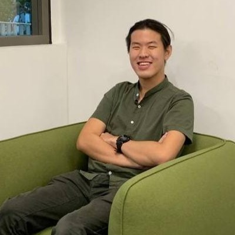
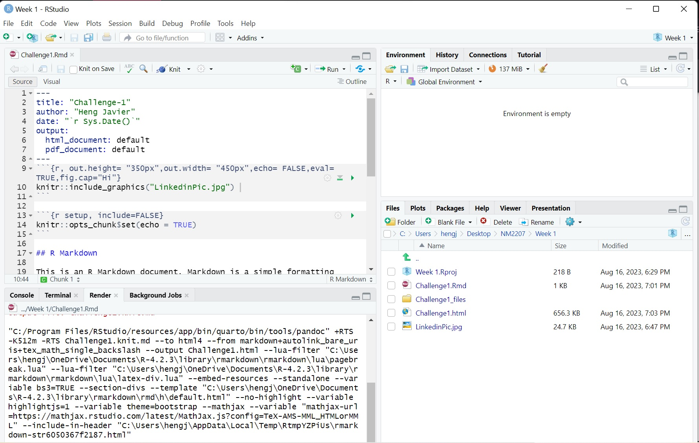

```{r, out.height= "350px",out.width= "450px",echo= FALSE,eval= TRUE,fig.cap="Hi"}
 
```
```{r, out.height= "350px",out.width= "450px",echo= FALSE,eval= TRUE,fig.cap="RStudio Layout"}
 
```

```{r setup, include=FALSE}
knitr::opts_chunk$set(echo = TRUE)
```

## About Me
Hi! I'm Javier, a Year 3 Psychology Student who is second Majoring in Communications and New Media. I enjoy making music in free time on the piano and I love to play games. 
