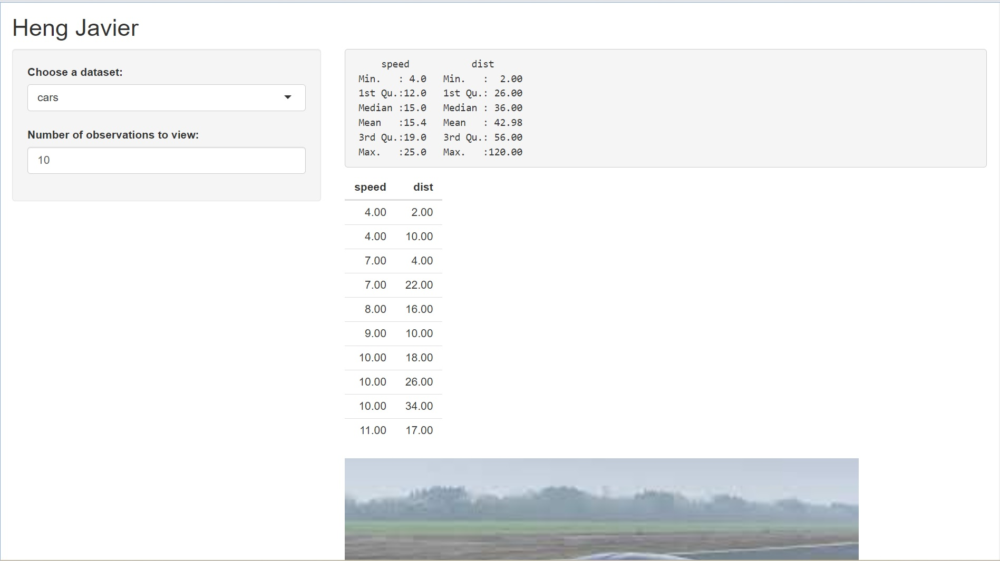

```{r setup, include=FALSE}
knitr::opts_chunk$set(echo = TRUE)
```
#Codealong Shiny
```{r, out.height= "350px",out.width= "450px",echo= FALSE,eval= TRUE,fig.cap="Codealong"}
knitr::include_graphics("codealong.jpg") 
```


#Using 02_text as a template, I added a dynamic image in the main panel which would change depending on which tab I was on, rock, pressure or cars. 
```{r, out.height= "350px",out.width= "450px",echo= FALSE,eval= TRUE,fig.cap="Rock"}
knitr::include_graphics("rock.jpg") 
```

```{r, out.height= "350px",out.width= "450px",echo= FALSE,eval= TRUE,fig.cap="Pressure"}
knitr::include_graphics("pressure.jpg") 
```
```{r, out.height= "350px",out.width= "450px",echo= FALSE,eval= TRUE,fig.cap="Cars"}
 
```
